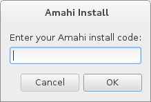

# 1. Download Amahi Express Disc
* Download amahi and burn it to a disc
* Boot your system from that disc

WARNING

It’s **very important** to understand that in the Express Disc installation, the first available drive will be **completely erased unless you change the default storage settings!**

  

# 2. Customize Your Settings and Install
* Set up the language
* Configure the date and time settings
* select your storage settings to match the destination where you want Amahi to be installed

  

* Make sure you configure the installation options

  

WARNING

It’s **very important** to understand that in the Express Disc installation, the first available drive will be **completely erased unless you change the default storage settings!**

* When your settings are ready click _Begin Installation_
* A root password is optional
* During installation create a user 
* Remember to make the user an administrator 

  

* The installation may be quick or take some time, depending on the speed of your hardware 
* Enter your Amahi install code for this system. You should have your install code from amahi.org 

  

* The networking settings you previously set for this system in the Amahi Control Panel should match what you have in your network 
* You will be asked to reboot. The Operating System will then boot from the hard drive, to a text console.
* Amahi will fully configure in the background and reboot by itself one last time, this time it will boot with the static IP address you set at Amahi.org

# 3. Initialize and Complete Install
* It is recommended for best operation that you turn off all other DHCP servers in your network. Then reboot all the systems in your network so that they get their network settings from your new Amahi server 
* Open an Internet browser from a client machine and type `http://hda/` in the URL box
* This will bring you to an initialization web page for your system

  

* If HDA does not work, you could try the IP address of your system to get to the initialization page 
* You will be asked to enter a username and password. Make sure you use the same capitalization here that you used for your username and password earlier

Start setting up your users, your shares, install some apps from `http://hda` and enjoy!!!
