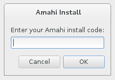

# 1. Important Notes

WARNING

In this Amahi Express installation, the first available drive WILL BE COMPLETELY ERASED unless you change the default storage settings!

* Upgrading from the previous Amahi releases (both Ubuntu- or Fedora-based) to Amahi 7 is currently **not supported**.
* A screencast of the process described below is available in the [Amahi 7 Express Install video](https://www.amahi.org/video/amahi-7-express-install).

# 1. Download Amahi Express
* The process of installing Amahi via the Express disc should take you 5 minutes in fast hardware (e.e. i5/i7 with SSD) to 15 or 10 minutes in older hardware and it's documented below in detail.
* If your system has more than one NIC (network interface), please disable **all but one** of them (usually in the BIOS)
* Download the [Amahi 7 Express Disc](https://wiki.amahi.org/index.php/Express_CD) and burn it to a DVD
* Boot your system from that DVD
* If you do not have optical drive try the recipe in the [install Amahi 7 from USB](https://wiki.amahi.org/index.php/Fedora_19_USB_install) page.

  

# 2. Customize Your Settings and Partition
* Set up the language, keyboard layout, the date and time settings
* Select your storage settings to match the destination where you want Amahi to be installed

  

* WARNING It’s important to understand that in the Express Disc installation, the first available drive will be **completely erased** unless you change the default storage settings!

* Partitioning and storage configuration is of **critical importance** and can be complex to many users.
* The Amahi team **strongly recommends** following this [hard drive partitioning guide](https://wiki.amahi.org/index.php/Hard_Drive_Partition_Scheme) for best results.

# 3. Install

* When your settings are ready, click _Begin Installation_
* The installation will proceed in the background
* Create a user and make it administrator (a root password is optional)

  

* The installation may be quick or take some time, depending on the speed of your hardware 
* Towards the end, enter your Amahi install code for this system. You should obtain your install code from [Amahi Control Panel](https://www.amahi.org)

  

* The networking settings you previously set for this system in the Amahi Control Panel should match what you have in your network, or the installation may not work in your network 
* You will be asked to reboot. The Operating System will then boot from the hard drive, to a text console.
* Amahi will fully configure in the background and reboot by itself **one last time**. This time it will boot with the static IP address you set up in the Amahi control panel.

# 4. Initialize Amahi and start using it

* It is recommended for best operation that you turn off all other DHCP servers in your network. Then reboot all the systems in your network so that they get their network settings from your new Amahi server 
* Open an Internet browser from a client machine and type `http://hda/` in the URL box
* This will bring you to an initialization web page for your system

  

* If `http://hda/` does not work , you could try the IP address of your system to get to the initialization page. This may be an indication troubleshooting may be needed. Make sure the settings in the control panel are what the network expects. Otherwise go through the [Networking Troubleshooter](http://www.amahi.net) (top right).

* This page will ask you to re-enter the username, password and password confirmation, to initialize the system. Make sure you use the same capitalization here that you used for your username and password earlier

* This page will take you to your server's Dashboard! Start setting up your users, shares, install some apps from Amahi's [app store](https://www.amahi.org/apps) and enjoy!

  
 

You can find other video screencasts at the [Amahi Videos](https://www.amahi.org/videos) page.

