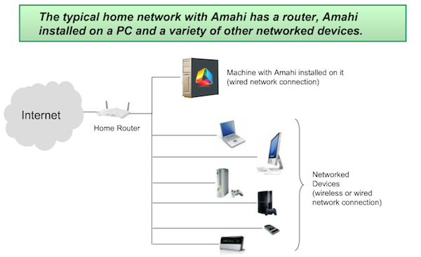

# Requirements

These are the requirements to install your Amahi Server.

1. Hardware

	A computer with minimum required specs of

	* 1GHz CPU
	* 4GB Disk, and
	* 768MB RAM (1GB+ recommended, 512MB _may_ work with small workloads)
	* The more CPU/Memory/Disk the better for you, of course! 
	* One *wired* network interface. Wireless interfaces are not supported in the server itself. Wireless networks are fully supported.

	**NOTE about networking:** Please **disable all but the one** interface you will use. Only the first **Ethernet** device is supported. Amahi requires that you physically remove or disable (typically at the BIOS) any additional network interfaces except the one you plan to use permanently

	Installing with one device and changing to another network device is not supported. The server is "bound" to one device after the install. Changing this is beyond most users.

1. Software

	The Amahi software CD/DVD.

1. Your Amahi install code

	You can get your install code by:

	* Making an account at [Amahi](https://www.amahi.org) 
	* Click on **Start building a new HDA** and follow the prompts

	Forgot your install code?  Find it at your [Amahi control panel](https://www.amahi.org/users).  

1. An internet connection during install

	Critical updates and configurations are performed at installation time via the network.

This diagram shows a typical Amahi setup in a small network

 
