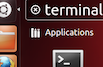
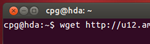
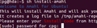
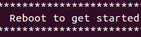
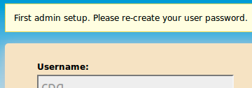

# Important Note

WARNING
**This Amahi release is unsupported at this time! Please use a supported release!
The latest release is [Amahi 8](amahi-8.html).**

# 1. Install Ubuntu

* Make sure you have properly configured a profile in your [Amahi control panel](https://www.amahi.org/users)
* Do **not** use an existing Ubuntu system: Amahi **cannot be uninstalled**.
* Choose if you want to use the Desktop (GUI) version of Ubuntu or the Server version (no desktop after install).
* Download the Ubuntu 12.04.2 LTS CD from the [Ubuntu 12.04.2 LTS page on old-releases.ubuntu.com](http://old-releases.ubuntu.com/releases/precise/) page according to your choice (Amahi has been tested to work on 12.04.2. Some users have experienced an error installing on 12.04.3.)
* Boot the installation machine from the Ubuntu installation CD. See the [requirements](requirements.html)
* Remember: do **not select and install** additional packages while installing Ubuntu. Amahi requires the default

### Desktop install (GUI)
* Install Ubuntu Desktop until you **get to the desktop**.
* See this article for <a href="http://netgator.blogspot.com/2012/04/ubuntu-1204-installation-process-slide.html" target="_blank">for illustrated instructions on installing Ubuntu Desktop</a>.

### Server install (headless)
WARNING
**SERVER INSTALL DOES NOT CURRENTLY WORK. [USE THIS WORK-AROUND](http://bugs.amahi.org/issues/1015) IF YOU MUST.**

* Install Ubuntu Server until you reboot and are at the command line.
* See this detailed guide for <a href="http://ubuntuserverguide.com/2012/05/how-to-install-ubuntu-server-12-04-lts-precise-pangolin-included-screenshot.html" target="_blank">installing Ubuntu Server</a>.
* Note that there is no support for a Desktop at the console. It's possible via [VNC](http://www.amahi.org/apps/vnc)

# 2. Install Amahi

* At the desktop, start a terminal window. On the Dash home, search for _terminal_. Click on the icon with caption _terminal_

	

* Execute the following two commands in the terminal window:

	`wget http://u12.amahi.org/install-amahi`

	`sh install-amahi`

	

* The first command gets the installer and the second one starts the Amahi install. The install script will ask for two things
	1. Your **install code**. You get this from your [Amahi control panel](https://www.amahi.org/users)
	1. Your **password**. Some of it runs as an administrator user

	

* This part may take about 5 to 10 minutes on a recent system, much more on older ones

* The time it takes depends on the speed of your PC and your internet connection 

* The system may pop up one or two windows asking you to update and/or check for updates manually. This is left up to you. Amahi does not recommend aggressively updating unless you are an expert Linux user.

* Once the installation is completed the installer **will ask you to reboot**

	

## Installation Notes

* Rebooting will change the IP address of your system to the address you gave in your [Amahi control panel](https://www.amahi.org/users) 

* Only the first ethernet card `eth0` is supported out of the box. See [other options](http://wiki.amahi.org/index.php/ETH1) 

# 3. Use Amahi!

* After rebooting, your Amahi HDA (Home Digital Assistant), should be fully working. Now it's time to set it up. When the system gets to the desktop, there are two links with Amahi logos on them. Click on the Dashboard one. Firefox should come up.

	

* Firefox should come up with `http://hda` and ask you to login.

* Use the user credentials **you created while installing Ubuntu**, not your Amahi web site login

* The first login is special. The first user will be set up at this point, by asking to reset the password.

	

* At this point the system should be set up and fully operational.

* To access your HDA from a remote system, things will only work if you have your DNS pointing to the Amahi system as otherwise your system cannot resolve the name "hda".

* If your HDA appears to work well, you may optionally [turn off the DHCP server](http://www.amahi.org/faq#is-dhcp-server-required) in your router/gateway and **reboot all clients** in your network, so that they get their IP from your HDA.

Start setting up your users, your shares, install some apps from `http://hda` and enjoy!!

Visit the [troubleshooting](troubleshooting.html) page for help.

**NOTE:**  SSH ([OpenSSH](http://www.amahi.org/apps/openssh) or [Dropbear](http://www.amahi.org/apps/dropbear)) and VPN ([OpenVPN](http://www.amahi.org/apps/openvpn)) are not installed by default.  You will need to install them via your HDA dashboard.
